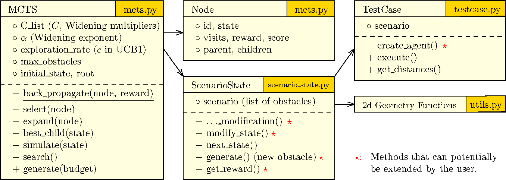

# PALM: An MCTS-based Tool for Testing Unmanned Aerial Vehicles


[](https://choosealicense.com/licenses/gpl-3.0/)


## Overview
PALM (**PA**th b**L**ocking **M**onte Carlo Tree Search) is a UAV test-case generator that adopts Monte Carlo Tree Search (MCTS) to search for different placements of obstacles in the environment. 
In this framework, adding a new obstacle is done by increasing the tree depth; instead, the addition of a new node in the current tree level is done to optimise the placement and the dimensions of the last added obstacle. 

The algorithm employs two key mechanisms to balance exploration and exploitation: UCB1 selection and progressive widening. 
The exploration rate (`exploration_rate`) parameter controls the balance between exploring less-visited nodes and exploiting high-reward nodes in the UCB1 formula, with higher values favoring exploration and lower values favoring exploitation. 
The progressive widening mechanism dynamically controls the number of children allowed at each tree node based on the node's visit count, preventing the tree from becoming too wide at shallow levels while allowing more exploration at deeper levels. 
This mechanism uses three parameters: `C` (scaling constant), `alpha` (exponent controlling the growth rate), and `C_list` (layer-specific multipliers for fine-grained control across different tree depths).

## Requirements
- Conda (Miniconda/Anaconda)
- Python 3.9+
- Aerialist (runtime)

## Installation
1) Create and activate a conda environment named `palm`
```bash
conda create -n palm python=3.9 -y
conda activate palm
```

2) Install Aerialist project (runtime)
- Follow the official guide: https://github.com/skhatiri/Aerialist#using-hosts-cli
- Enter its samples folder:
```bash
cd Aerialist/samples
```

3) Clone this project and install dependencies
```bash
git clone https://github.com/MayDGT/PALM.git
cd PALM
pip install -r requirements.txt
```

4) Create the required directories
```bash
mkdir -p logs results/logs
```

## Configuration
All runtime parameters are configured in `configs/config.yaml`.

```yaml
### Core inputs
# Path to mission YAML used by `ScenarioState` and `MCTS`.
# This path is resolved relative to the project root.
mission_yaml: "case_studies/mission1.yaml"

# Total number of MCTS iterations (total simulations allowed)
budget: 100

# Parent folder to store generated test artifacts (yaml, ulg, png)
tests_folder: "generated_tests"

### Scenario hyperparameters
# Maximum number of obstacles allowed in a scenario before it is considered terminal
max_obstacles: 3

### MCTS hyperparameters
# UCB1 exploration constant (higher favors exploration)
exploration_rate: 0.70710678  # ~ 1 / sqrt(2)

# Progressive widening: scaling constant (C), exponent (alpha), and per-layer widening multipliers (C_list)
# The progressive widening formula: max_children = C_list[layer] * (visits ** alpha)
C: 0.5                    # Scaling constant (stored but currently not directly used; C_list is used instead)
alpha: 0.5                # Exponent controlling how visit count affects allowed children
C_list: [0.4, 0.5, 0.6, 0.7]  # Per-layer widening multipliers for fine-grained control across tree depths
random_seed: 42            # Random seed for reproducibility (0 = no seed/non-deterministic, positive int = fixed seed for reproducible results)
```

### Parameter Details

**Progressive Widening Parameters:**

- **`C`**: Scaling constant (stored but currently not directly used; `C_list` is used instead)
- **`alpha`**: Exponent controlling how visit count affects allowed children
  - **Larger alpha** (e.g., 0.7-1.0): Faster growth of allowed children as visits increase → More exploration, tree widens quickly, more diverse scenarios explored
  - **Smaller alpha** (e.g., 0.3-0.5): Slower growth, tree stays narrower longer → More exploitation, focuses on promising branches, fewer children per node
- **`C_list`**: Per-layer widening multipliers for fine-grained control across tree depths
  - Each value corresponds to a tree depth/layer (index 0 = root, 1 = depth 1, etc.)
  - **Larger values**: Allow more children at that layer → more exploration at that depth
  - **Smaller values**: Restrict children at that layer → more exploitation at that depth
  - Typically increases with depth (as shown) to allow more exploration deeper in tree
  - **Design rationale**: Progressive increase (0.4→0.7) restricts shallow tree width to prevent combinatorial explosion, while allowing deeper exploration for fine-tuning obstacle placements as the search space becomes more constrained
  - Must have length ≥ `max_obstacles` to cover all expected tree depths

### Notes

- Paths may be absolute or relative to the project root.
- On Windows, prefer paths like `D:/data/results/`.

## Usage
Basic run with default `configs/config.yaml`:
```bash
python main.py
```

Output:
- Results saved under `<tests_folder>/<timestamp>/` as:
  - `test_i.yaml`: Generated test case
  - `test_i.ulg`: Flight log
  - `test_i.png`: Plot

**Note**: The tests_folder (e.g., `generated_tests`) is automatically created if it doesn't exist.

## Reproducibility
Using the default configuration in `configs/config.yaml` (with `budget: 100`), PALM will generate 100 test scenarios. The expected outputs and performance are 
summarized below.

### Output Structure
- **`results/`**: Contains 100 scenario plot images 
- **`results/logs/`**: Contains 100 scenario flight logs 
- **`generated_tests/<timestamp>/`**: Contains failure cases only, each with:
  - `test_i.yaml`: Generated test case configuration
  - `test_i.png`: Scenario visualization
  - `test_i.ulg`: Flight log

### Performance Expectations
- **Runtime**: Approximately 7 hours on our test machine
- **Failure Detection**: Around 47 failure scenarios totally found
- **Test Machine Configuration**:
  - OS: Ubuntu 20.04
  - Memory: 32GB
  - CPU: Intel Core i7-13700K
- **Note**: Due to the randomness in the algorithm and the non-deterministic nature of the system under test, results may vary between runs

### Running the Experiment
To reproduce the results, run:
```bash
python main.py
```

## Project structure
```
PALM/
├─ main.py                    # Main entry point: loads configuration, initializes MCTS, runs test generation, and saves results
├─ configs/
│  └─ config.yaml             # Configuration file containing runtime parameters (mission path, budget, MCTS hyperparameters)
├─ case_studies/              # Directory containing mission YAML files and test artifacts (logs, plots, flight plans)
├─ palm/
│  ├─ mcts.py                 # Monte Carlo Tree Search implementation with UCB1 selection and progressive widening
│  ├─ scenario_state.py       # Manages scenario state: obstacle generation/modification, trajectory simulation, reward calculation
│  ├─ testcase.py             # Wraps DroneTest execution, handles test runs via agents, computes distances, provides plotting/saving
│  └─ utils.py                # Utility functions for geometric operations (random rectangles, circle coverage, boundary calculations)
├─ results/ 
│  └─ logs/ 
└─ logs/ (created at runtime)
```

For a detailed UML diagram of the project architecture:




